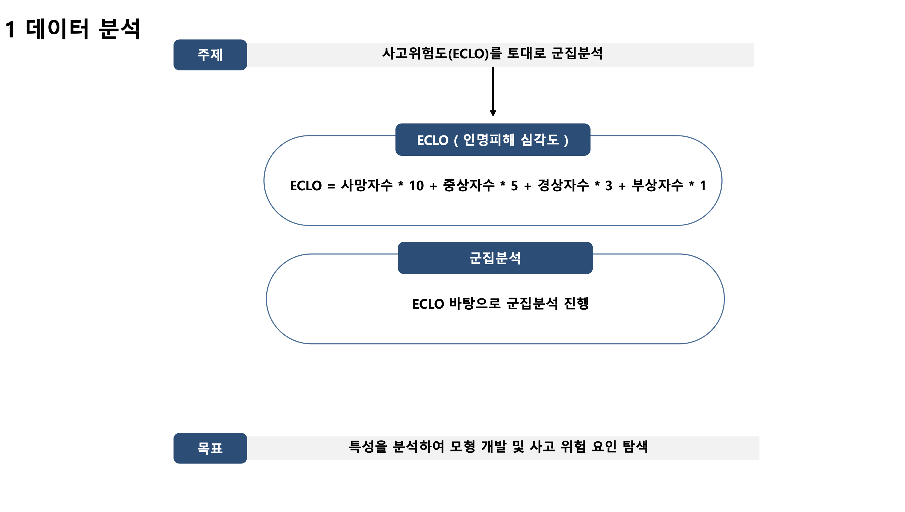
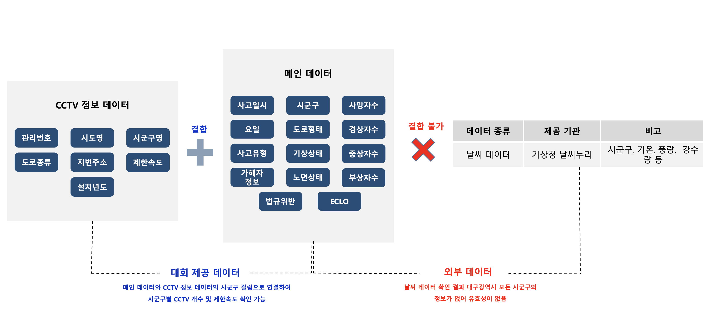
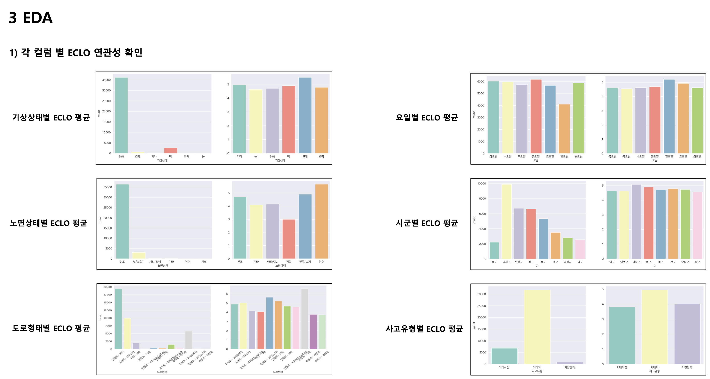
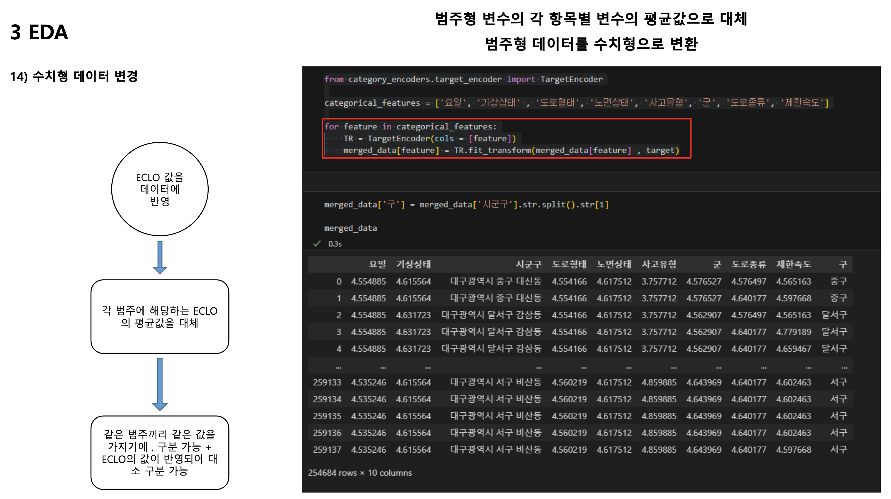

# 프로젝트 제목- 대구 교통사고 위험지역 군집분석 및 분류 모델 개발

 

### 목차
- [개요](#intro)
- [프로젝트 주제](#subject)
- [결과물 예시](#result)

## <a id='intro'>프로젝트 개요</a>

Dacon에서 진행한 <b>대구 교통사고 피해 예측 AI 경진대회</b> 의 데이터를 활용하여 , 데이터 분석에서 모델링까지 한 Project입니다.

<b>공모전 URL : [https://dacon.io/competitions/official/236193/overview/description](https://dacon.io/competitions/official/236193/overview/description)</b>

## <a id='subject'>프로젝트 주제</a>

한국의 교통사고 사망자수가 매우 높은 것으로 알려져 있고 , 실제로 교통사고로 인한 통계와 기사도 있습니다.

_참고 뉴스_

[한국, 교통사고 사망자수 OECD 36개국 중 27위… 10만명당 6.5명](https://www.safetynews.co.kr/news/articleView.html?idxno=209365)

[보행자 교통사고 OECD 회원국 평균보다 2배 높아, 보행안전 대책 시급](https://m.boannews.com/html/detail.html?tab_type=1&idx=103316)

물론 , 위의 기사가 나온 2021년부터 현재까지 계속해서 교통사고는 줄어들고 있다고 합니다. 하지만 , 여전히 지역마다 교통사고 비율의 차이가 존재하며 , 광역시와 같이 사람이 많이 모이는 지역은 <b>교통사고의 위험이 클 것이라고 생각이 됩니다.</b>

그래서 , 대구광역시의 지역데이터와 그 외의 여러 교통데이터를 이용해서 , <b>1번째로 교통사고 위험지역을 군집분석을 진행하여 나누고</b> , 그리고 <b>2번째로 나뉘어진 데이터를 토대로 , 분류 모델을 만드는 것</b>으로 교통사고 위험지역을 분류하는 모델을 진행하고자 계획 했습니다.

### Dataset
데이터는 Dacon의 <b>대구 교통사고 피해 예측 AI 경진대회</b>의 데이터를 활용하였습니다.

<b>데이터 셋 URL : [https://dacon.io/competitions/official/236193/data](https://dacon.io/competitions/official/236193/data)</b>

## 일정
2023년 11월 27일 ~ 2023년 12월 22일

## <a id='result'>결과물 예시</a>
  

 
 
<b>최종 결과물로서는 발표용 PDF 그리고 분석 코드 입니다.</b>
